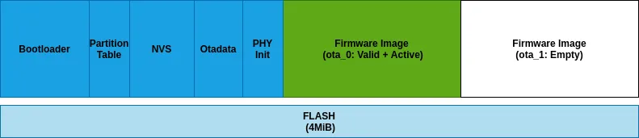

# Informações básicas que voce precisa saber antes de começar

## Partitions table

Uma única memória flash do ESP32-C3 pode conter vários aplicativos, bem como muitos tipos diferentes de dados (dados de calibração, sistemas de arquivos, armazenamento de parâmetros, etc.). Por esse motivo, uma tabela de partição é armazenada em flash com ( deslocamento padrão ) 0x8000.

A biblioteca Preferences é baseada na API NVS   (Non-Volatile Storage) e salva dados na partição `nvs`. 

No ESP32-C3 (e outros ESP32), os dados de calibração — como calibração de rádio, Wi-Fi, Bluetooth e ajustes de RF — são gravados em uma partição especial chamada `phy_init`.

A partição `factory` no ESP32 (incluindo o ESP32-C3) é uma partição de aplicativo usada para armazenar o firmware "de fábrica", ou seja, o primeiro firmware gravado na placa, antes de qualquer atualização OTA.

``` csv
# ESP-IDF Partition Table
# Name,   Type, SubType, Offset,  Size, Flags
nvs,      data, nvs,     0x9000,  0x4000,
otadata,  data, ota,     0xd000,  0x2000,
phy_init, data, phy,     0xf000,  0x1000,
factory,  app,  factory, 0x10000,  1M,
ota_0,    app,  ota_0,   0x110000, 1M,
ota_1,    app,  ota_1,   0x210000, 1M,

```





`ota_0` (0x10) ... `ota_15`(0x1F) são os slots de aplicativos OTA. Quando o OTA está em uso, a partição de dados OTA configura qual slot de aplicativo o bootloader deve inicializar. Ao usar OTA, um aplicativo deve ter pelo menos dois slots de aplicativos OTA ( `ota_0` & `ota_1`).

Saiba mais sobre tabela de partições em [Espressif: partitions table](https://docs.espressif.com/projects/esp-idf/en/stable/esp32c3/api-guides/partition-tables.html)

## Application description

O segmento do binário da aplicação `DROM`, começa com a estrutura `esp_app_desc_t` que carrega campos específicos que descrevem o aplicativo:

```C
typedef struct {
    uint32_t magic_word;        /*!< Magic word ESP_APP_DESC_MAGIC_WORD */
    uint32_t secure_version;    /*!< Secure version */
    uint32_t reserv1[2];        /*!< reserv1 */
    char version[32];           /*!< Application version */
    char project_name[32];      /*!< Project name */
    char time[16];              /*!< Compile time */
    char date[16];              /*!< Compile date*/
    char idf_ver[32];           /*!< Version IDF */
    uint8_t app_elf_sha256[32]; /*!< sha256 of elf file */
    uint32_t reserv2[20];       /*!< reserv2 */
} esp_app_desc_t;
```

Essa estrutura é útil para identificar imagens enviadas por meio de atualizações OTA (Over-the-Air), pois possui um deslocamento fixo = sizeof( `esp_image_header_t`) + sizeof( `esp_image_segment_header_t`). Assim que um dispositivo recebe o primeiro fragmento contendo essa estrutura, ele tem todas as informações para determinar se a atualização deve ser continuada ou não.

Para obter a estrutura `esp_app_desc_t`  do aplicativo em execução no momento, use `esp_app_get_description()`.

Para obter a estrutura `esp_app_desc_t` de outra partição OTA, use `esp_ota_get_partition_description()`.

- Versao: Para definir a versão do seu projeto manualmente, você precisa definir a variável `PROJECT_VER`  no `CMakeLists.txt` do seu projeto. Em  `CMakeLists.txt` , coloque `.set(PROJECT_VER "0.1.0.1")`  antes de incluir o `project.cmake` .

- Versao de segurança: Versão de segurança incorporada na imagem.  Agrupa imagens de firmware com base em correções contra vulnerabilidades de segurança (por exemplo, certificado CA revogado).  Se voce quer evitar  a sobrecarga   caso o aplicativo do servidor tenha uma versão de segurança inferior à do aplicativo em execução, obtenha o secure_version das versões e compare. Use `esp_efuse_check_secure_version(new_app_info.secure_version)`continue o download caso a função retorne verdadeira e , caso contrário, aborte.

```c
....
bool image_header_was_checked = false;
while (1) {
    int data_read = esp_http_client_read(client, ota_write_data, BUFFSIZE);
    ...
    if (data_read > 0) {
        if (image_header_was_checked == false) {
            esp_app_desc_t new_app_info;
            if (data_read > sizeof(esp_image_header_t) + sizeof(esp_image_segment_header_t) + sizeof(esp_app_desc_t)) {
                // check current version with downloading
                if (esp_efuse_check_secure_version(new_app_info.secure_version) == false) {
                  ESP_LOGE(TAG, "This a new app can not be downloaded due to a secure version is lower than stored in efuse.");
                  http_cleanup(client);
                  task_fatal_error();
                }

                image_header_was_checked = true;

                esp_ota_begin(update_partition, OTA_SIZE_UNKNOWN, &update_handle);
            }
        }
        esp_ota_write( update_handle, (const void *)ota_write_data, data_read);
    }
}
...
```

Saiba mais em [Espressif: App image format](https://docs.espressif.com/projects/esp-idf/en/latest/esp32c3/api-reference/system/app_image_format.html)
