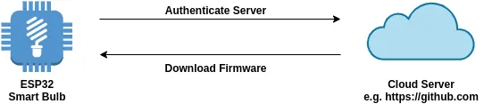

# API HTTPS OTA
É uma camada de abstração sobre as APIs OTA existentes. Este componente de software fornece uma API simplificada para atualizar dispositivos com segurança através do canal TLS. A API aceita dois parâmetros obrigatórios: a URL HTTPS onde a imagem do firmware está hospedada e o certificado do servidor para validar a identidade do servidor.

```c
esp_err_t do_firmware_upgrade()
{
    esp_http_client_config_t config = {
        .url = CONFIG_FIRMWARE_UPGRADE_URL,
        .cert_pem = (char *)server_cert_pem_start,
    };
    esp_https_ota_config_t ota_config = {
        .http_config = &config,
    };
    esp_err_t ret = esp_https_ota(&ota_config);
    if (ret == ESP_OK) {
        esp_restart();
    } else {
        return ESP_FAIL;
    }
    return ESP_OK;
}
```
##  Verificação do servidor TLS
A verificação do servidor é um passo crucial para garantir a segurança durante uma atualização de firmware via HTTPS. O objetivo é confirmar que o dispositivo está de fato se conectando ao servidor legítimo que hospeda a nova imagem de firmware, e não a um servidor malicioso. 

Para realizar a verificação do servidor, o certificado raiz em formato PEM precisa ser fornecido. Este certificado deve ser passado para o membro `cert_pem` da estrutura `esp_http_client_config_t`. 

O trecho de código é mostrado abaixo, supondo que a imagem do firmware esteja hospedada no github.com:

```c
esp_http_client_config_t config = { 
     .url = "https://raw.githubusercontent.com/caminho/para/firmware", 
     .cert_pem = (char *) github_server_start_pem, 
};
esp_err_t ret = esp_https_ota(&config); 
se (ret == ESP_OK) { 
     esp_restart(); 
}
```

O esp_http_client_config_t possui propriedades `username` e `password` para autenticação http. Entretanto o GitHub não suporta autenticação Basic para download de arquivos via HTTPS de repositórios privados. Ele usa autenticação via token (Personal Access Token - PAT) com OAuth2-style no cabeçalho Authorization.
O esp nao possui OAuth2 implementado, mas há um jeito de fazer.

Enviar um token que já autoriza o download sem precisar de autenticação adicional no cabeçalho HTTP

```c
esp_http_client_config_t config = {
    .url = "https://raw.githubusercontent.com/firmware.bin?token=MEU_TOKEN_VALIDO",
    .cert_pem = servidor_certificado,
};

esp_https_ota(&config);
```
Isso funciona desde que:
- O link seja direto para o arquivo .bin
- O token seja um signed token (JWT, assinatura de URL, etc.) que:
    - Autoriza o download
    - É válido sem cabeçalhos adicionais
- O servidor aceite esse token no parâmetro da URL e retorne o arquivo diretamente

Nao funciona se 
- Autenticação OAuth2 com troca de tokens, refresh tokens, etc.
- Situações em que o token precisa ser enviado como: 
    - `Authorization: Bearer <token>`
    - Isso exigiria configurar um cabeçalho HTTP adicional no cliente — e o esp_https_ota() não permite isso diretamente.

O workflow simplificado para atualização OTA se parece com o seguinte:



## Arquivo sdkconfig.defaults

Configuração de Partição:
- `CONFIG_PARTITION_TABLE_TWO_OTA`: Habilita uma tabela de partição pré-definida que suporta três partições de aplicação: factory, OTA_0 e OTA_1. Isso é essencial para o mecanismo OTA que escreve novas imagens em slots de aplicação inativos. Ou utilize  CONFIG_PARTITION_TABLE_CUSTOM para personalizar uma partição

Configuração de Conexão (para download via HTTPS)
- Opções no menu "Example Connection Configuration" para escolher a interface de rede (Wi-Fi ou Ethernet) e fornece SSID e senha do WI-FI
- `CONFIG_FIRMWARE_UPGRADE_URL`: Define a URL completa do firmware a ser baixado para a atualização

Configurações de Segurança e Verificação
- `CONFIG_ESP_TLS_PSK_VERIFICATION`: Habilita o uso de pre-shared keys para verificação do servidor
- `CONFIG_ESP_TLS_INSECURE` e `CONFIG_ESP_TLS_SKIP_SERVER_CERT_VERIFY`: Opções inseguras para fins de teste que permitem pular a verificação do certificado do servidor
- `CONFIG_ESP_TLS_SERVER_CERT_SELECT_HOOK`: Habilita um hook de seleção de certificado do servidor ao usar MbedTLS
- `CONFIG_SECURE_SIGNED_APPS_NO_SECURE_BOOT` e `CONFIG_SECURE_SIGNED_ON_UPDATE_NO_SECURE_BOOT`: Permitem a verificação de assinaturas de imagens OTA mesmo sem o secure boot por hardware habilitado

Configurações de Rollback
- `CONFIG_BOOTLOADER_APP_ROLLBACK_ENABLE`: Habilita o recurso de rollback, que permite rastrear o primeiro boot de uma nova aplicação e reverter para a versão anterior caso a nova não seja validada. Ao habilitar isso, uma opção para definir um GPIO de input para diagnóstico pode ser configurada
-  `CONFIG_BOOTLOADER_APP_ANTI_ROLLBACK`: Habilita a função anti-rollback, que previne o boot de aplicações com versão de segurança inferior à armazenada no eFuse do chip. Esta opção é usada em conjunto com `CONFIG_BOOTLOADER_APP_ROLLBACK_ENABLE`
- `CONFIG_BOOTLOADER_APP_SEC_VER_SIZE_EFUSE_FIELD`: Permite reduzir o tamanho do campo secure_version no eFuse

Outras Configurações OTA:
-  `CONFIG_ESP_HTTPS_OTA_ALLOW_HTTP`: Permite o download de firmware OTA via plain HTTP (sem TLS), o que não é seguro e recomendado apenas para testes
- `CONFIG_ESP_HTTPS_OTA_DECRYPT_CB`: Habilita o uso de um callback de desencriptação externo para OTAs com firmware pré-encriptado

```
# Default sdkconfig parameters to use the OTA, 4MB flash size
CONFIG_ESPTOOLPY_FLASHSIZE_4MB=y
CONFIG_PARTITION_TABLE_TWO_OTA=y

# Use a tabela de partição personalizada sem partição de fábrica
CONFIG_PARTITION_TABLE_CUSTOM=y
CONFIG_PARTITION_TABLE_CUSTOM_FILENAME="partitions_example.csv"

# Habilitar versão de firmware a partir da opção de configuração
CONFIG_APP_PROJECT_VER_FROM_CONFIG=y
CONFIG_APP_PROJECT_VER="1"

# Habilitar recursos de reversão e anti-reversão de firmware 
CONFIG_BOOTLOADER_APP_ROLLBACK_ENABLE=y
CONFIG_BOOTLOADER_APP_ANTI_ROLLBACK=y

# Defina a versão de segurança inicial como 0 
CONFIG_BOOTLOADER_APP_SECURE_VERSION=0

# Definir tamanho do campo eFuse da versão de segurança 
CONFIG_BOOTLOADER_APP_SEC_VER_SIZE_EFUSE_FIELD=32

# Emular versão segura por meio de partição flash para teste 
CONFIG_BOOTLOADER_EFUSE_SECURE_VERSION_EMULATE=y

# Use a imagem de firmware hospedada no github
 CONFIG_EXAMPLE_FIRMWARE_UPGRADE_URL="https://raw.githubusercontent.com/mahavirj/advanced_https_ota/master/test_firmware/advanced_https_ota.bin"
``` 

Exemplo de partição Partitions_example.csv  sem partição de fábrica:

```csv
# Name,   Type, SubType, Offset,   Size, Flags
# Note: if you have increased the bootloader size, make sure to update the offsets to avoid overlap
nvs,      data, nvs,     ,        0x4000,
otadata,  data, ota,     ,        0x2000,
phy_init, data, phy,     ,        0x1000,
emul_efuse, data, 5,     ,        0x2000,
ota_0,    app,  ota_0,   ,        1M,
ota_1,    app,  ota_1,   ,        1M,
```

## Esqueleto função ota 

```c
ESP_LOGI(TAG, "Starting Advanced OTA example");

esp_err_t ota_finish_err = ESP_OK;
esp_https_ota_handle_t https_ota_handle = NULL;
esp_http_client_config_t config = {
    .url = CONFIG_EXAMPLE_FIRMWARE_UPGRADE_URL,
    .cert_pem = (char *)server_cert_pem_start,
    .timeout_ms = CONFIG_EXAMPLE_OTA_RECV_TIMEOUT,
};

//Aplica o config 
esp_https_ota_config_t ota_config = {
    .http_config = &config,
    .http_client_init_cb = _http_client_init_cb, // Register a callback to be invoked after esp_http_client is initialized
};

// Esta função inicializa o contexto ESP HTTPS OTA e estabelece a conexão HTTPS. Esta função deve ser invocada primeiro. 
esp_err_t err = esp_https_ota_begin(&ota_config, &https_ota_handle);
if (err != ESP_OK) {
    ESP_LOGE(TAG, "ESP HTTPS OTA Begin failed");
    vTaskDelete(NULL);
}


// Lê a descrição do aplicativo no cabeçalho da imagem. A descrição do aplicativo fornece informações como a "versão do firmware" da imagem.
esp_app_desc_t app_desc;
err = esp_https_ota_get_img_desc(https_ota_handle, &app_desc);
if (err != ESP_OK) {
    ESP_LOGE(TAG, "esp_https_ota_read_img_desc failed");
    goto ota_end;
}

//Crie uma função para validar o cabeçalho


//esp_https_ota_perform lê dados de imagem do fluxo HTTP e os grava na partição OTA. Esta função deve ser chamada somente se esp_https_ota_begin() retornar com sucesso. Esta função deve ser chamada em um loop, pois retorna após cada operação de leitura HTTP, dando a você a flexibilidade de interromper a operação OTA no meio do caminho.
while (1) {
    err = esp_https_ota_perform(https_ota_handle);
    if (err != ESP_ERR_HTTPS_OTA_IN_PROGRESS) {
        break;
    }
    // Dados de imagem OTA lidos até o momento.
    ESP_LOGD(TAG, "Image bytes read: %d", esp_https_ota_get_image_len_read(https_ota_handle));
}

// Verifica se dados completos foram recebidos ou não.
if (esp_https_ota_is_complete_data_received(https_ota_handle) != true) {
    // the OTA image was not completely received and user can customise the response to this situation.
    ESP_LOGE(TAG, "Complete data was not received.");
}
else{
    // Limpeza do HTTPS OTA, atualização do firmware e encerramento da conexão HTTPS. 
    // Se esta API retornar com sucesso, esp_restart() deve ser chamado para inicializar a partir da nova imagem de firmware.
    ota_finish_err = esp_https_ota_finish(https_ota_handle);
}

if ((err == ESP_OK) && (ota_finish_err == ESP_OK)) {
    ESP_LOGI(TAG, "ESP_HTTPS_OTA upgrade successful. Rebooting ...");
    vTaskDelay(1000 / portTICK_PERIOD_MS);
    esp_restart();
}
```