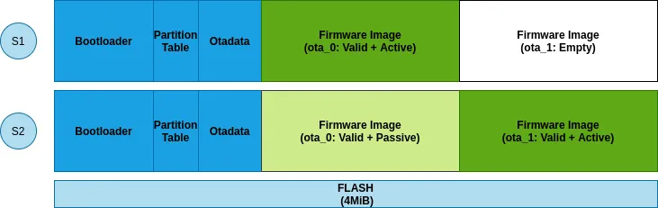
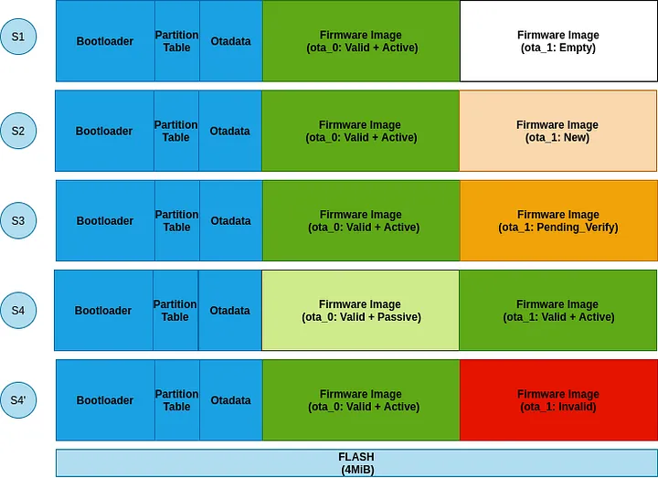
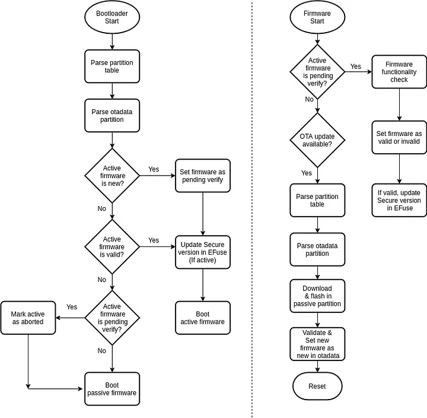

# Visão geral
O mecanismo de atualização OTA permite que um dispositivo se atualize com base nos dados recebidos enquanto o firmware normal está em execução (por exemplo, via Wi-Fi, Bluetooth ou Ethernet).
O OTA requer a configuração das tabelas de partição do dispositivo com pelo menos 2 partições OTA do tipo app(`ota_1`e `ota_0`) e uma OTA do tipo Data (`ota`).


## Transição entre partições

O bootloader inicializa o aplicativo de fabrica. Se nenhum aplicativo de fábrica estiver incluído na tabela de partição (partição `factory`), o primeiro slot OTA disponível (geralmente `ota_0`) é inicializado. Se houver `factory`, `ota_0`e `ota_1` não deve conter dados (todos os bytes devem ser apagados para 0xFF).  

Na primeira atualização OTA, o primeiro slot OTA disponível (geralmente `ota_0`) é gravado e, a partição de dados OTA é atualizada para especificar qual partição de slot de aplicativo OTA deve ser inicializada em seguida (`ota_0`). 

Na proxima atualização OTA, o novo firmware ficará gravado em `ota_1`. A partição de dados `ota` é então atualizada para especificar qual partição de slot de aplicativo OTA deve ser inicializada em seguida. Assim, a partir do RESET subsequente, o bootloader sempre dará o controle ao firmware na `ota_1` (até a próxima atualização OTA).



## Rollback
No cenário acima, se houver algum problema (por exemplo, falha na inicialização do firmware) no firmware recém-atualizado da partição `ota_1`, não há como o dispositivo retornar ao firmware anterior que funciona. O recurso de rollback(reversão de firmware) oferece a capacidade de reverter para o firmware funcional anterior conhecido.

-  A primeira atualização OTA grava uma nova imagem de firmware  e marca seu estado como `ESP_OTA_IMG_NEW`
-  Após o RESET, o bootloader vê um novo firmware com estado `ESP_OTA_IMG_NEW`e muda seu estado para `ESP_IMAGE_PENDING_VERIFY`, pois sua funcionalidade ainda não foi validada.
- Assim que o novo firmware inicia a execução, ele pode definir seu estado para `ESP_OTA_IMG_VALID`ou `ESP_OTA_IMG_INVALID`com base na lógica do aplicativo. 

```c
const esp_partition_t *running = esp_ota_get_running_partition();
esp_ota_img_states_t ota_state;
if (esp_ota_get_state_partition(running, &ota_state) == ESP_OK) {
    if (ota_state == ESP_OTA_IMG_PENDING_VERIFY) {
        // run diagnostic function ...
        bool diagnostic_is_ok = diagnostic();
        if (diagnostic_is_ok) {
            ESP_LOGI(TAG, "Diagnostics completed successfully! Continuing execution ...");
            esp_ota_mark_app_valid_cancel_rollback();
        } else {
            ESP_LOGE(TAG, "Diagnostics failed! Start rollback to the previous version ...");
            esp_ota_mark_app_invalid_rollback_and_reboot();
        }
    }
}
```
- Se o aplicativofor marcado como `ESP_OTA_IMG_INVALID` na reinicialização subsequente, o bootloader atualiza seu estado para `ESP_OTA_IMG_ABORTED` e, assim, retorna ao firmware anterior.



! A função de diagnóstico pode ser decidida com base em vários pontos, como por exemplo, conexão À rede WIFI, pois garante a possibilidade da próxima atualização OTA.

## Anti-Rollback
O rollback oferece a capacidade de retornar ao firmware anterior, mas às vezes isso pode não ser uma operação desejada. Muitas vezes, uma atualização de firmware de um dispositivo também pode modificar algumas credenciais de segurança (por exemplo, o certificado do servidor) incorporadas nele. Isso implica que todas as imagens de firmware mais antigas estão praticamente obsoletas e, se executadas, podem apresentar riscos de segurança. O recurso " Anti-rollback de Firmware " pode ajudar a mitigar esses problemas. Anti-rollback é um recurso que permite executar firmware somente se a versão de segurança incorporada for superior à programada na EFuse `secure_version` 


## OTA e Flash encryption 

O firmware pode ser pré-criptografado antes de hospedado no servidor. A distribuição de firmware pré-criptografada garante que a imagem do firmware permaneça criptografada durante o transporte do servidor para o dispositivo (independentemente da segurança de transporte subjacente).
O firmware pré-criptografado é um esquema completamente independente da Criptografia Flash. Mesmo para dispositivos onde a criptografia flash não está habilitada, pode ser necessário que a imagem do firmware via OTA ainda seja criptografada.
Primeiro, a camada de software pré-criptografada descriptografa o firmware (recebido pela rede) no dispositivo e, em seguida, criptografa novamente o conteúdo usando a criptografia flash da plataforma e a chave do EFuse (se habilitada) antes de gravar na flash.

## Notas importantes
- Os recursos discutidos acima, como "rollback" e "anti-rollback", devem ser habilitados antes do release. Esses recursos habilitam determinados caminhos de código no bootloader, que por si só não podem ser atualizados em campo.
-  Recomenda-se que qualquer tipo de modo de economia de energia (por exemplo, modo de espera do modem WiFi) seja desativado durante a atualização OTA. Isso permite uma taxa de transferência ideal para transferência de dados.
- Durante a atualização OTA, o flash passa por operações de programação (apagar/escrever) e, portanto, o cache flash permanece desabilitado. Se houver alguma interrupção que precise ser mantida habilitada, ela deverá ser registrada com seu manipulador na memória de código interna (IRAM). Mais informações sobre isso podem ser encontradas [aqui](https://docs.espressif.com/projects/esp-idf/en/latest/esp32/api-reference/peripherals/spi_flash/index.html) .

## fluxograma 




## Referencias 

Saiba mais em 

[Espressif: process overview](https://docs.espressif.com/projects/esp-idf/en/stable/esp32c3/api-reference/system/ota.html#ota-process-overview)

[Medium: Ota updates framework](https://medium.com/the-esp-journal/ota-updates-framework-ab5438e30c12)
