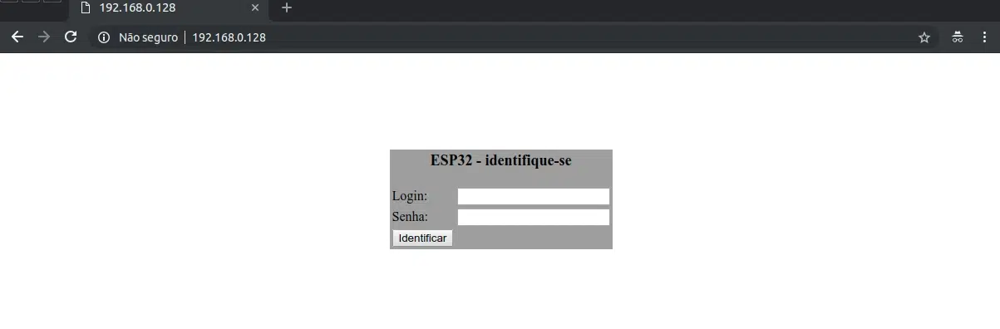
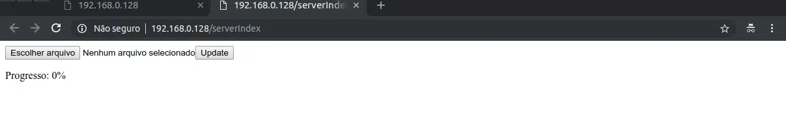

# Web Updater

Um web server é criado no ESP32, permitindo que via browser (navegador de Internet) usando de seu computador, smartphone ou tablet seja possível enviar o software ao ESP32, de forma que ele se atualiza sozinho ao final do processo de envio.
Ainda, neste caso é possível colocar uma autenticação (usuário e senha), permitindo que somente as pessoas que tenham estas credenciais consigam fazer atualização de software no ESP32.

!Para atualização com ESP32 em outras redes, é necessário o uso de VPNs 

## Como funciona
1. Inicialmente, para o processo funcionar, é necessário que o software que está rodando no ESP32 suporte atualização OTA via web updater.
2. Uma vez que o software do ESP32 possua suporte a atualização OTA via web updater, será possível acessar o recurso de atualização pelo browser (através do IP do ESP32 na rede).
3. Pelo browser é enviado o novo software ao ESP32 e, após o upload, o ESP32 será reiniciado e já fará o boot com o software novo. É importante lembrar que, para futuras atualizações OTA, este novo software também precisa suportar atualização OTA via web updater. Caso contrário, será impossível atualizar este software via OTA.






## Estrutura codigo

! Esse código foi implementado n oesp32, verifique possiveis diferenças para o esp32-c3

```c
#include <WiFi.h>
#include <WiFiClient.h>
#include <WebServer.h>
#include <ESPmDNS.h>
#include <Update.h>

// Webserver para se comunicar via browser com ESP32 
WebServer server(80);


/* Códigos da página que será aberta no browser 
   (quando comunicar via browser com o ESP32) 
   Esta página exigirá um login e senha, de modo que somente 
   quem tenha estas informações consiga atualizar o firmware
   do ESP32 de forma OTA */
const char* loginIndex = 
 "<form name='loginForm'>"
 (...)
"</form>"
"<script>"
(...)
"</script>";
 
const char* serverIndex = 
"<script src='https://ajax.googleapis.com/ajax/libs/jquery/3.2.1/jquery.min.js'></script>"
"<form method='POST' action='#' enctype='multipart/form-data' id='upload_form'>"
  (...)
 "</script>";

void setup(void) 
{
    /* Conecta-se a rede wi-fi */
    WiFi.begin(ssid, password);

    /* Usa MDNS para resolver o DNS */
    if (!MDNS.begin(host)) 
    { 
        //http://esp32.local
        Serial.println("Erro ao configurar mDNS. O ESP32 vai reiniciar em 1s...");
        delay(1000);
        ESP.restart();        
    }

    /* Configfura as páginas de login e upload de firmware OTA */
    server.on("/", HTTP_GET, []() 
    {
        server.sendHeader("Connection", "close");
        server.send(200, "text/html", loginIndex);
    });
    
    server.on("/serverIndex", HTTP_GET, []() 
    {
        server.sendHeader("Connection", "close");
        server.send(200, "text/html", serverIndex);
    });

    /* Define tratamentos do update de firmware OTA */
    server.on("/update", HTTP_POST, []() 
    {
        server.sendHeader("Connection", "close");
        server.send(200, "text/plain", (Update.hasError()) ? "FAIL" : "OK");
        ESP.restart();
    }, []() {
        HTTPUpload& upload = server.upload();
        
        if (upload.status == UPLOAD_FILE_START) 
        {
            /* Inicio do upload de firmware OTA */
            Serial.printf("Update: %s\n", upload.filename.c_str());
            if (!Update.begin(UPDATE_SIZE_UNKNOWN)) 
                Update.printError(Serial);
        } 
        else if (upload.status == UPLOAD_FILE_WRITE) 
        {
            /* Escrevendo firmware enviado na flash do ESP32 */
            if (Update.write(upload.buf, upload.currentSize) != upload.currentSize) 
                Update.printError(Serial);      
        } 
        else if (upload.status == UPLOAD_FILE_END) 
        {
            /* Final de upload */
            if (Update.end(true))             
                Serial.printf("Sucesso no update de firmware: %u\nReiniciando ESP32...\n", upload.totalSize);
            else
                Update.printError(Serial);
        }   
    });

    // Inicializa o servidor 
    server.begin();
}

void loop() 
{
    // verifique o Webserver
    server.handleClient();
    delay(1);
 
    // Faça o que você tem que fazer 
}


```

## Referencias
O codigo completo está disponivel em [examples](../examples/esp_ota_server.ino)

Veja o cogigo completo e mais informações em:
https://www.makerhero.com/blog/atualizacao-de-software-ota-over-the-air-no-esp32/?srsltid=AfmBOoqDFvrbp68h9WQedmuc6kGOPKhI1Np1q63s5VHb7bFCbEliVQ8e

